## Section 6: Supabase Object Store
Supabase is an open-source Firebase alternative that provides developers with a complete backend-as-a-service platform centered around PostgreSQL, a powerful relational database system offering full SQL capabilities, real-time subscriptions, and robust extensions for scalable data management. Its object storage is an S3-compatible service designed for storing and serving files like images, videos, and user-generated content.

Website: https://supabase.com/

**Requirements**:
- Build a document upload and file management system powered by Supabase. The backend will include API endpoints to interact with Supabse.
- **Note:** The detailed requirement will be discussed in week 4 lecture.
- Make regular commits to the repository and push the update to Github.
- Capture and paste the screenshots of your steps during development and how you test the app. Show a screenshot of the documents stored in your Supabase Object Database.

Test the app in your local development environment, then deploy the app to Vercel and ensure all functionality works as expected in the deployed environment.

**Steps with major screenshots:**

> [your steps and screenshots go here]

## Section 7: AI Summary for documents
**Requirements:**  
- **Note:** The detailed requirement will be discussed in week 4 lecture.
- Make regular commits to the repository and push the update to Github.
- Capture and paste the screenshots of your steps during development and how you test the app.
- The app should be mobile-friendly and have a responsive design.
- **Important:** You should securely handlle your API keys when pushing your code to GitHub and deploying your app to the production.
- When testing your app, try to explore some tricky and edge test cases that AI may miss. AI can help generate basic test cases, but it's the human expertise to  to think of the edge and tricky test cases that AI cannot be replace. 

Test the app in your local development environment, then deploy the app to Vercel and ensure all functionality works as expected in the deployed environment. 

**Steps with major screenshots:**

Enter text on the page and click "Generate Text Summary"：
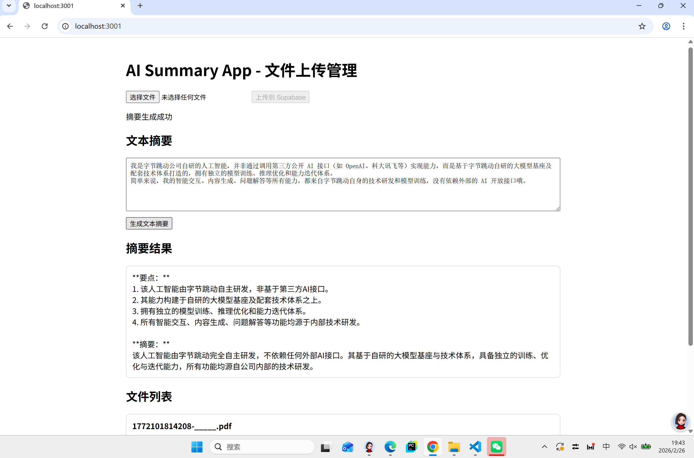

Click "Generate Summary for This File"
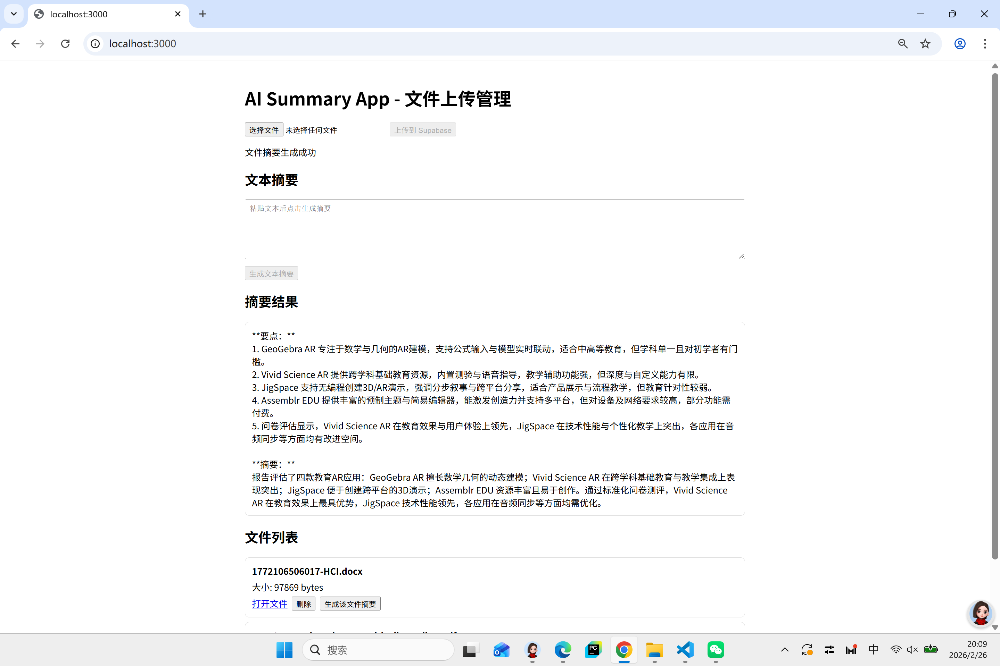

deploy the app to Vercel successfully:
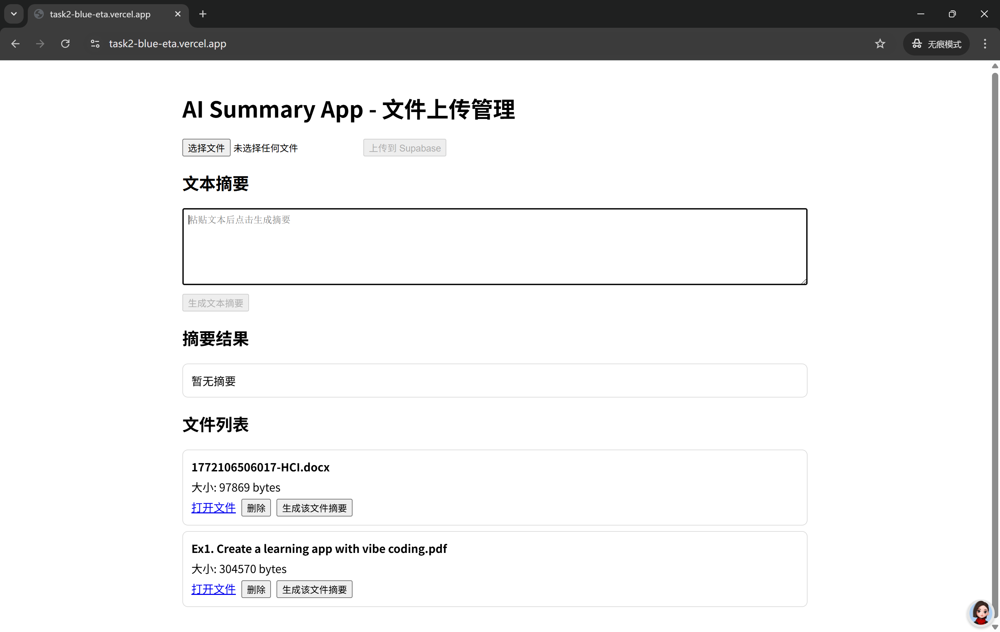
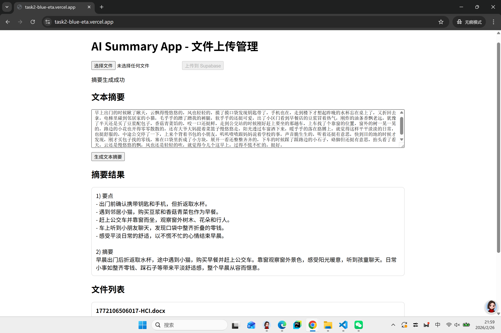
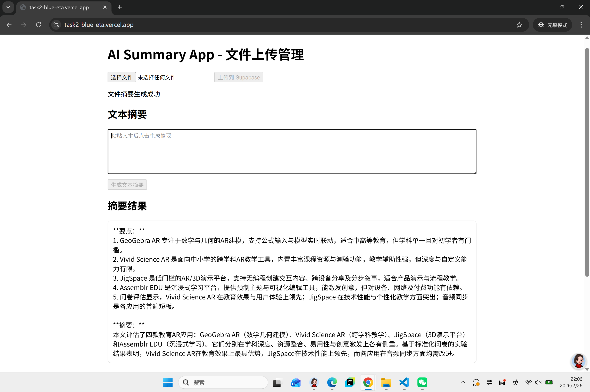

## Section 8: Database Integration with Supabase  
**Requirements:**  

Test the app in your local development environment, then deploy the app to Vercel and ensure all functionality works as expected in the deployed environment.
1. I created a Postgres table in Supabase to store uploaded document metadata and AI summaries.
	- Table name: `document_summaries`
	- Main fields: `file_name`, `storage_path`, `public_url`, `summary`, `created_at`, `updated_at`

2. I integrated the backend APIs with Supabase Postgres:
	- `upload` API now inserts one row after a successful file upload.
	- `summarize` API now updates the `summary` field for the matched `storage_path`.

3. I tested the workflow locally:
	- Upload a document.
	- Generate summary for that uploaded file.
	- Verify the corresponding row is created and updated in Supabase Table Editor.

4. I validated the same workflow in the deployed Vercel environment and confirmed the database write/update behavior is consistent with local testing.

**Screenshots:**

- Supabase SQL Editor / table creation (`document_summaries`):
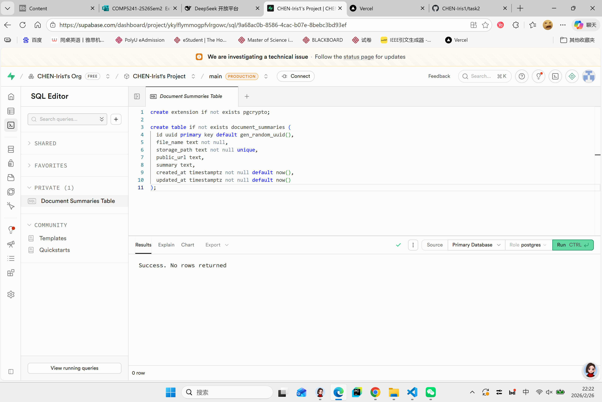
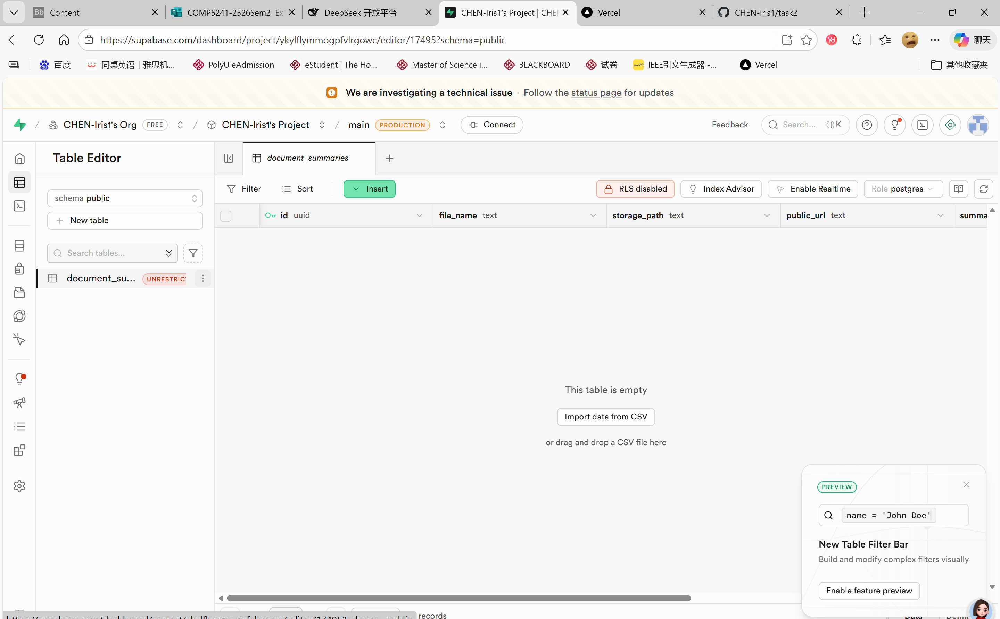
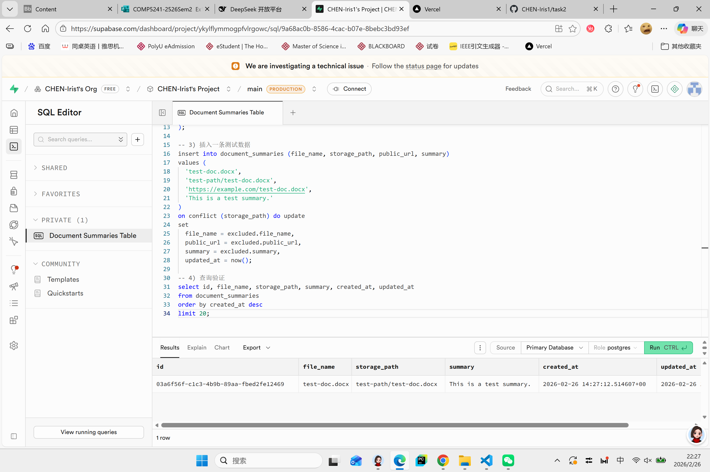
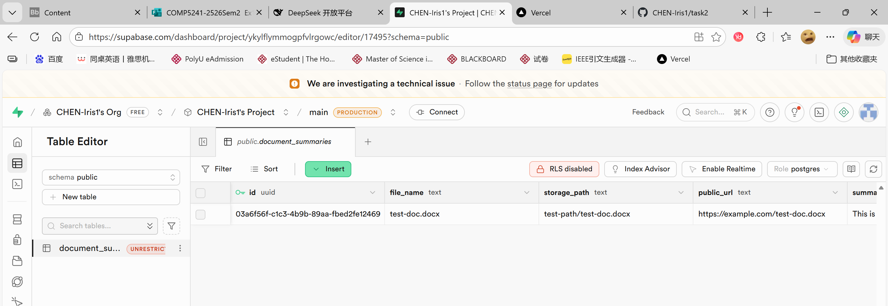

- Local app test: upload + summary generation success:
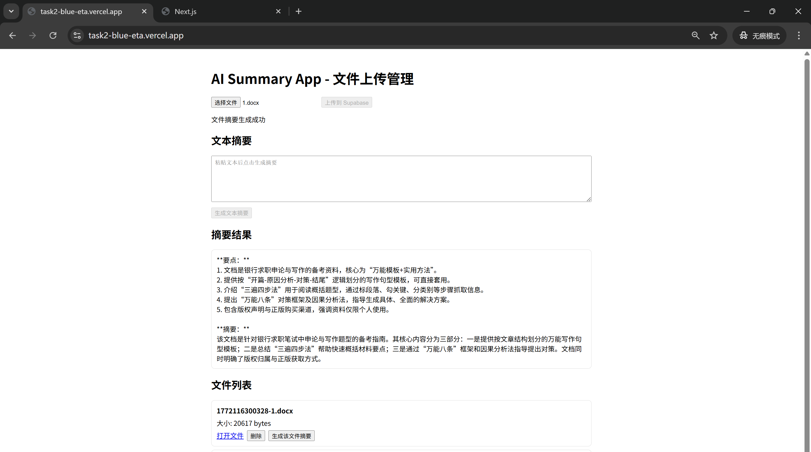
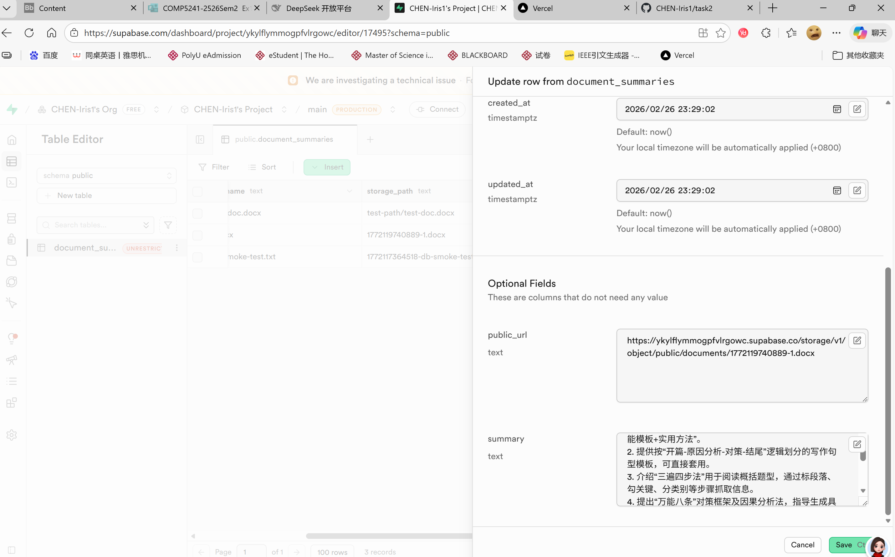

## Section 9: Additional Features [OPTIONAL]
Implement at least one additional features that you think is useful that can better differentiate your app from others. Describe the feature that you have implemented and provide a screenshot of your app with the new feature.

> [Description of your additional features with screenshot goes here]

Provide a function for switching between Chinese and English：
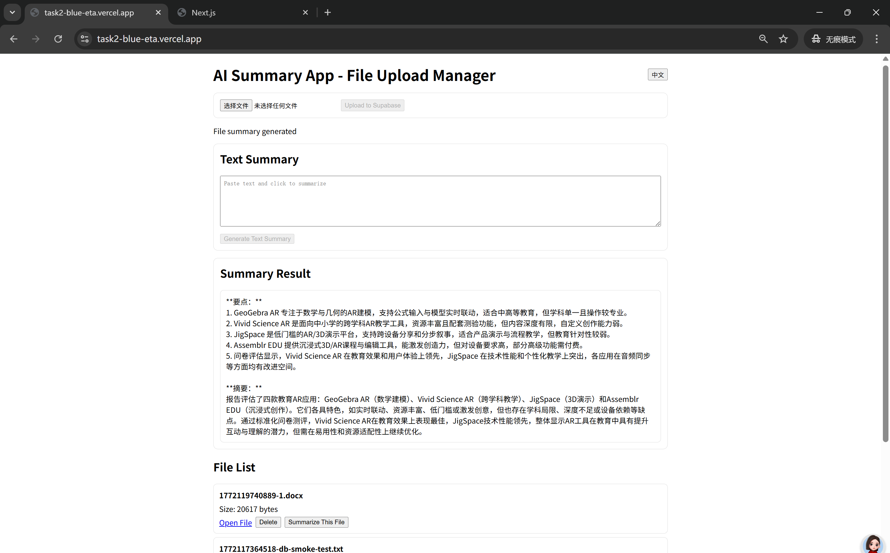
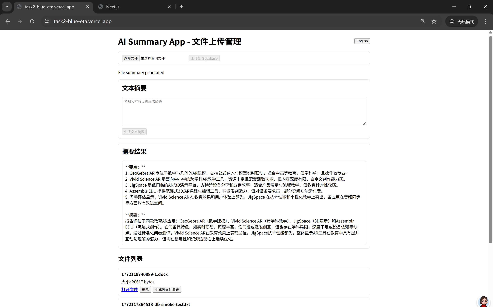

Add a list of uploaded files with a page-turning function, with no more than 5 files per page.
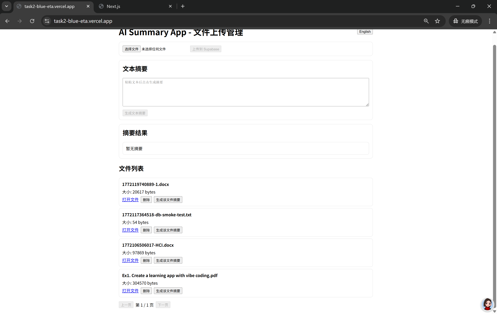

